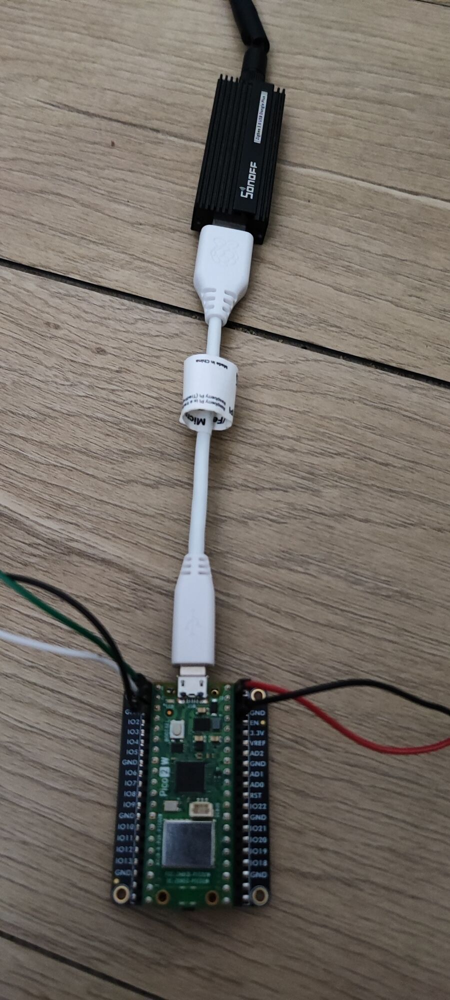

# Pico Z-Stack Zigbee Coordinator PoC

A bare-metal C proof-of-concept demonstrating how to use a **Raspberry Pi Pico** as a USB Host to control a **Texas Instruments Z-Stack Zigbee Coordinator** (specifically the **Sonoff Zigbee 3.0 USB Dongle Plus-P**).

This project uses the Pico C/C++ SDK and TinyUSB to send raw Monitor and Test (MT) API commands directly to the CC2652P chip over a USB CDC connection. 

## 🚀 Features

* **USB Host CDC:** Utilizes TinyUSB in host mode to enumerate and communicate with the Sonoff Dongle.
* **Network Management:** Formats a Zigbee network, registers application endpoints, and opens the network for pairing (Permit Join).
* **Device Discovery:** Parses Link Quality Indicator (LQI) neighbor tables to discover newly paired devices.
* **Active Interrogation:** Automatically requests the IEEE address and Device Name (Basic Cluster `0x0000`) of newly discovered nodes.
* **ZCL Parsing:** Includes basic logic to parse Zigbee Cluster Library (ZCL) incoming messages, such as extracting plain-text names and reading the On/Off Cluster (`0x0006`) state for door/window sensors.
* **Spam Prevention:** Maintains a `known_devices` list to prevent flooding the network with duplicate queries.

## 🛠 Hardware Requirements

1. **Raspberry Pi Pico** (The `CMakeLists.txt` is currently targeting `pico2_w`, but can be modified for standard Picos).
2. **USB OTG Cable:** Micro-USB Male to USB-A Female adapter.
3. **Zigbee Coordinator:** Sonoff Zigbee 3.0 USB Dongle Plus (Model "P" / CC2652P).
4. **USB to TTL Serial Adapter:** For debugging and monitoring serial output from the Pico (optional but recommended).
5. **5V regulated power supply:** To power the Pico and the USB Dongle.
6. **Test Device:** A standard Zigbee end device (e.g., Xiaomi Aqara Door/Window sensor `lumi.sensor_magnet.aq2`).

## 🔌 Wiring

1. Connect the Sonoff Zigbee Dongle to the USB OTG adapter, and then connect it to the Raspberry Pi Pico micro-USB port.
2. If using a USB to TTL Serial Adapter, connect it to the Pico's UART pins for serial debugging.
    * Tx -> GPIO0 (UART0 TX)
    * Rx -> GPIO1 (UART0 RX)
    * GND -> GND
    * Power -> unused (power the Pico separately)
3. Power the Pico using a **regulated** 5V supply.
    * 5V -> VBUS
    * GND -> GND

## 💻 Building and Flashing the Project

1. Use VSCode with the official [Pico extension](https://marketplace.visualstudio.com/items?itemName=raspberry-pi.raspberry-pi-pico) for easier building and flashing.

2. `Ctlr+Shift+P` -> `CMake: Configure`

3. Click `Compile` in bottom bar.

4. Remove the regulated 5V power supply from VBUS

5. Remove the USB OTG adapter from the Pico, and connect the pico to your computer via USB. This will allow you to flash the firmware onto the Pico via USB mass storage.

6. Put your Pico 2 W into BOOTSEL mode (hold the BOOTSEL button while plugging it in).

7. Click `Run` in bottom bar.

8. Remove the USB from your computer and reconnect the USB OTG adapter to the Pico after flashing.

9. Attach the regulated 5V power supply to VBUS and GND. 

⚠️ Do not power the Pico through both USB and the regulated 5V supply at the same time, as this can cause damage. Always ensure that only one power source is connected at a time.

## 📜 License
This project is licensed under the MIT License. See the [LICENSE](LICENSE) file for details.

## 🙏 Acknowledgements
- [Z-Stack Monitor and Test API](https://dev.ti.com/tirex/explore/node?isTheia=false&node=A__ACh9le-N7XEoxabGqQcHgQ__com.ti.SIMPLELINK_CC13XX_CC26XX_SDK__BSEc4rl__LATEST)
- [TinyUSB](https://github.com/hathach/tinyusb)
- [Pico examples usb host](https://github.com/raspberrypi/pico-examples/tree/master/usb/host)